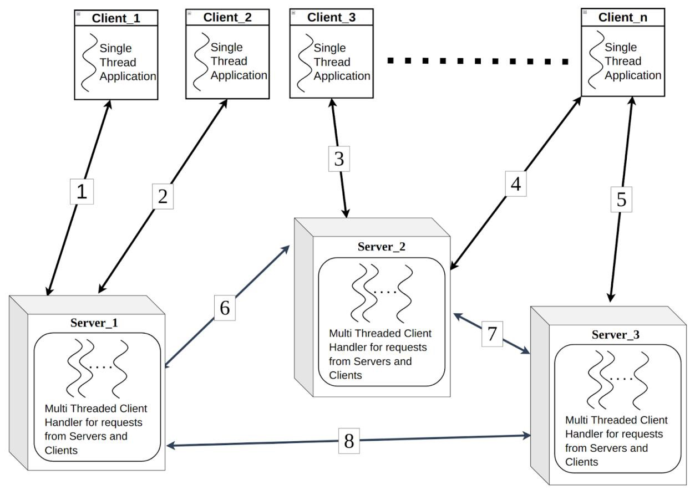
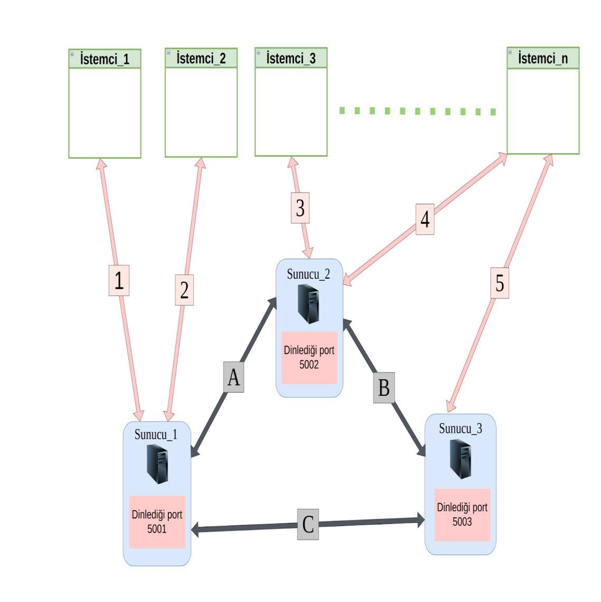
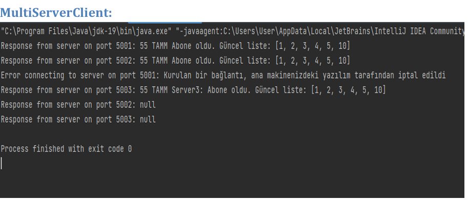
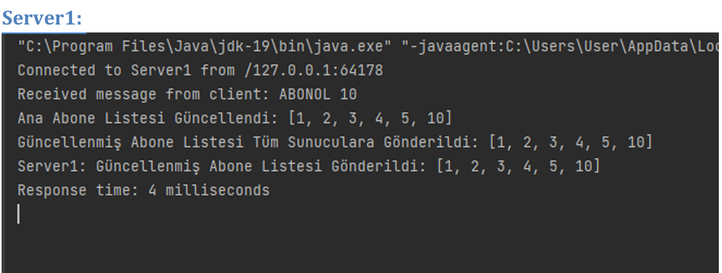
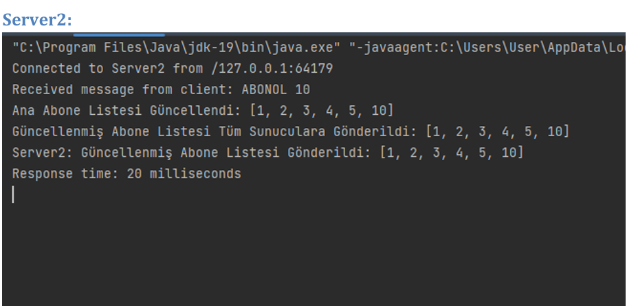
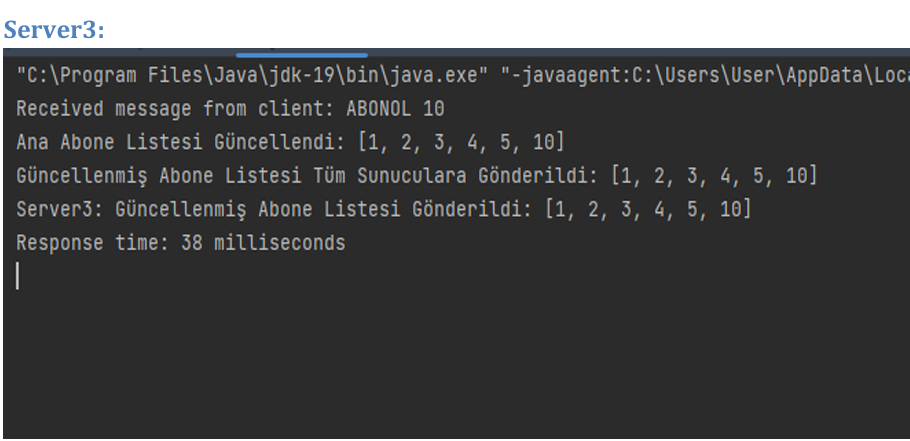

# Dağıtık Abonelik Sistemi (Distributed Subscriber Service)
1- Sunucuların daha hızlı haberleşmesi için gönderilen nesne üzerinde yaptığınız iyileştirmeleri 
yazınız.  
Object Serialization (Nesne Serileştirme): Nesnelerin doğrudan serileştirilip gönderilmesi, 
metin tabanlı bir protokol yerine daha etkili olabilir. Bu, nesne üzerinde işlem yapmadan 
önce tüm sunucular arasında aynı veri formatını kullanmanıza olanak tanır. 
Socket Bağlantılarını Güncelleme: Socket bağlantılarını olabildiğince uzun süre açık 
tutmak, bağlantı kurma ve sonlandırma maliyetlerini azaltabilir. Bu, veri alışverişi 
sırasında bağlantı kurmak yerine aynı bağlantı üzerinden iletişim kurmayı içerir. 

2- Sunucuların nesneleri serileştirme performansını artırmak için yaptığınız iyileştirmeleri ve 
araştırmaları yazınız. 
Binary Protokollerin Kullanılması:JSON ve XML gibi metin tabanlı veri formatları yerine, 
binary protokollerin kullanılması performansı artırabilir. Örneğin, Google'ın Protocol 
Buffers veya Apache Thrift gibi binary serileştirme kütüphaneleri bu konuda etkilidir. 
Data Compression (Veri Sıkıştırma):Serileştirilmiş veriyi sıkıştırma, ağ trafiğini azaltabilir 
ve veri transfer hızını artırabilir. Gelişmiş sıkıştırma algoritmaları kullanmak, performansı 
olumlu yönde etkileyebilir. 
Lazy Loading ve Partial Serialization:Lazy loading, nesnelerin sadece ihtiyaç 
duyulduğunda yüklenmesini sağlar. Aynı şekilde, partial serialization ile sadece belirli 
alanların serileştirilmesi sağlanabilir, bu da veri transferini azaltır. 
Thread Pool Kullanımı:Sunucularda gelen bağlantıları işlemek için bir thread pool 
kullanmak, çok sayıda isteği daha etkili bir şekilde yönetmeye yardımcı olabilir. 
Binary Format ve Veri Boyutu Optimize Edilmesi:Veriyi daha etkili bir şekilde temsil eden, 
ancak hala okunabilir bir binary format kullanmak önemlidir. Veri boyutunu optimize 
etmek, ağ üzerindeki veri transferini azaltarak performansa katkı sağlar. 
Object Pooling:Nesne havuzları (object pooling) kullanarak, sürekli olarak nesne 
oluşturma ve yok etme işlemlerini azaltabilirsiniz. Bu, bellek yönetimi ve performans 
açısından faydalı olabilir. 
Concurrency ve Parallelism İncelemeleri:Sunucu uygulamasında çoklu iş parçacığı veya 
paralel işleme kullanarak performans artırımı sağlayabilirsiniz. Ancak, bu durumda 
senkronizasyon sorunlarına dikkat etmek önemlidir. 
Cache Kullanımı:Sık kullanılan veya genellikle değişmeyen verileri bir önbelleğe (cache) 
almak, her seferinde tekrar tekrar serileştirip gönderme ihtiyacını azaltarak performansı 
artırabilir. 
Profiling ve Monitoring:Uygulama üzerinde profiling ve monitoring yaparak, performans 
sorunlarını tespit edebilir ve iyileştirmeler için odaklanılacak alanları belirleyebilirsiniz

3- Varsa uygulamanızı test etmek için yaptığınız testleri ve proje ile ilgili eklemek istediklerinizi 
yazınız. 
Birim Testleri (Unit Tests):Temel işlevleri test etmek için birim testleri yazın. Bu, her bir 
modülünüzün doğru çalıştığından emin olmanıza yardımcı olacaktır. 

Entegrasyon Testleri:Sunucular arasındaki iletişimi ve işbirliğini test etmek için 
entegrasyon testleri oluşturun. Farklı sunucular arasında doğru veri alışverişini kontrol 
edin.
Performans Testleri:Sunucularınızın ve uygulamanızın performansını test edin. Aynı anda 
çok sayıda isteği işleyebilme kapasitesini, ağ trafiğini ve veri transferini değerlendirin. 
Yük Testleri:Uygulamanıza aynı anda çok sayıda kullanıcının bağlanması ve işlem yapması 
durumunu simüle eden yük testleri gerçekleştirin. Bu, uygulamanın dayanıklılığını ve yük 
altında nasıl performans gösterdiğini değerlendirir. 
Bağlantı Dayanıklılığı Testleri:Ağ bağlantılarındaki kopmalar veya hatalar durumunda 
uygulamanın nasıl tepki verdiğini test edin. Bağlantı dayanıklılığını kontrol ederek 
uygulamanın sağlamlığını artırabilirsiniz. 
Güvenlik Testleri:Uygulamanızın güvenliğini değerlendirmek için güvenlik testleri 
gerçekleştirin. Özellikle sunucu iletişimi sırasında veri güvenliği önemlidir. 
Hata Senaryoları Testleri:Uygulamanızın hata durumlarına nasıl tepki verdiğini kontrol 
edin. Hatalı girişler, sunucu kesintileri gibi senaryoları simüle ederek uygulamanın 
istikrarını değerlendirin. 
Bellek ve Kaynak Kullanım Testleri:Uygulamanın bellek kullanımını ve kaynakları doğru bir 
şekilde yönetip yönetmediğini kontrol edin. Bellek sızıntıları ve kaynak tükenmeleri 
konusunda testler yapın. 
Uygulama Otomasyon Testleri:Özellikle sürekli entegrasyon (CI) ortamlarında kullanılmak 
üzere otomasyon testleri geliştirin. Otomasyon, tekrarlanabilir ve sürekli bir test sürecini 
destekler. 
Araçlar ve Framework'ler Kullanımı:Uygulamanızı test etmek için uygun araçlar ve test 
framework'lerini kullanın. JUnit, TestNG, Selenium, Apache JMeter gibi araçlar test 
sürecinizi destekleyebilir.

  
  
### Yapılanlar

- [x] Java programlama diliyle Taşıma (Transport) Katmanı gönderim fonksiyonlarını kullanarak 
dağıtık bir abonelik sistemi geliştirmeniz beklenmektedir.
- [x] Bu abonelik sistemi soket üzerinde SMTP, HTTP vb. bir protokol yerine ödev kapsamında 
ortaya atılan ASUP (Abonelik Servisi Uyelik Protokolü) isminde ilkel bir protokol ile temel 
sözdizimi aşağıda paylaşılan sırada gerçekleşmelidir. 
- [x] Yük dağılımı, hata tolerans vb. taleplerde başvurulan dağıtık mimaride her bir sunucu, 
aboneleri ve abonelerin sistemde çevrimiçi/çevrimdışı olduğu bilgileri tutmaktadır. İstemci bir 
sunucudan abone olup; bir başka sunucudan sisteme giriş yapabilmelidir. 
- [x] Sunucular listenin diğer sunucularda da güncellenmesi sonrası (güncel listeyi alan diğer 2 
sunucudan “55 TAMM” mesajı gelmesinden sonra) hizmet verdiği istemciye yanıt dönmelidir.
- [x] Her sunucu concurrent (eşzamanlı) istemci erişimi sırasında bünyesindeki listelere erişimi 
thread-safe sunmak zorundadır. (Kritik bölgelerde lock, synchronized vb. yapılar 
kullanılmalıdır.)   

  
  
  
  
  

### Ekip üyeleri

- 21060644, İclal Gül İpek
- 21060665, Eylül Ülgen

### Sunum Videosu Linki

